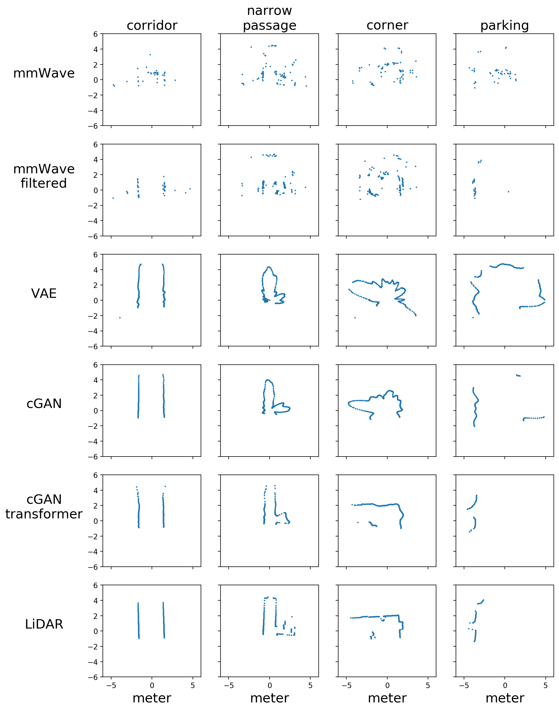

# radar-transformer

demonstrate generative reconstruction for mmWave radar point clouds.

-  Variational Autoencoder 

-  conditional Generative Adverserial Network  

-  conditional Generative Adverserial Network with transformer

visual compare

